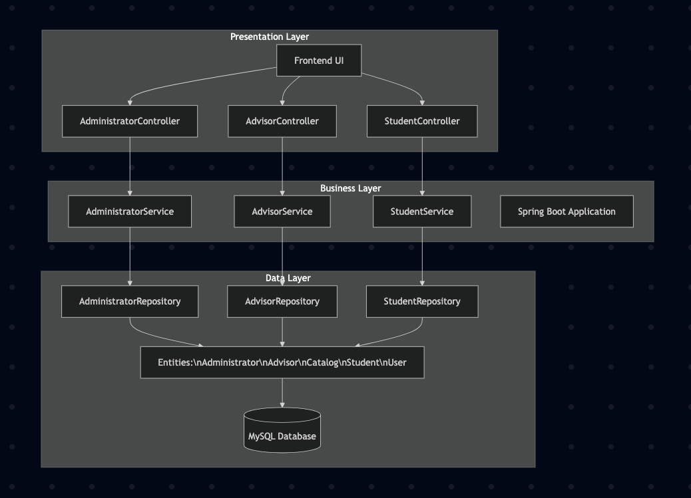

# improved-enrollment-system

Improve the Crunet system, courses could be organized into clear categories such as general education, electives, and core requirements. The system should also display how many remaining credit hours are needed in each category and indicate whether a student meets the prerequisites for a given course.

We split our app into three layers:

Presentation Layer (Layer 1) - What the user sees (HTML/CSS/JS) and the Spring controllers:
- AdministratorController, AdvisorController, StudentController. These accept HTTP requests from the brwser and pass them to the service layer.

Business Layer (Layer 2) - the app logic lives here:
- AdministratorService, AdvisorService, StudentService. Services do the real work for our application. ImprovedEnrollmentSystemApplication.java is the Spring Boot main class that runs the app.

Data Layer (Layer 3) - repositories and entity classes that talk to the database:
- AdministratorRepository, AdvisorRepository, StudentRepository, and the entity classes (Administrator, Advisor, Catalog, Student, User). The data is saved in MySQL.

How things talk to eachother 
1. Registering for a class
    * Browser → StudentController.
    * StudentController → StudentService.
    * StudentService → StudentRepository / Catalog entities → MySQL.
    * Response goes back: Repository → Service → Controller → Browser.
2. Advisor viewing advisees
    * Browser → AdvisorController.
    * AdvisorController → AdvisorService → AdvisorRepository → MySQL → back up to browser.
3. Admin updating catalog
    * Browser → AdministratorController → AdministratorService → AdministratorRepository → MySQL.